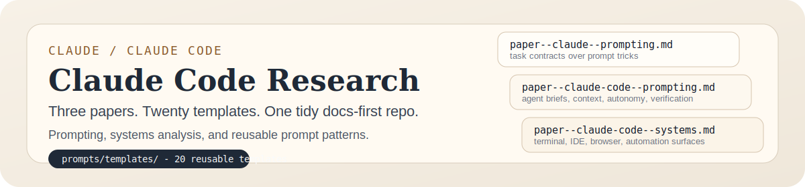
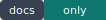

<!-- markdownlint-disable MD041 -->
<!-- markdownlint-disable MD033 -->
<picture>
  <source media="(prefers-color-scheme: dark)" srcset=".github/assets/readme-banner-dark.svg">
  
</picture>
<!-- markdownlint-enable MD033 -->
<!-- markdownlint-enable MD041 -->

Three research papers on Claude and Claude Code, plus 20 prompt templates
distilled from them.

  

Docs-only repo. No app, no crawler, no benchmark harness, no hidden product.

## Current papers

| Paper | Scope |
| ----- | ----- |
| [Claude prompting](docs/papers/paper--claude--prompting.md) | Prompt design for Claude as a task-contract problem, not a wording-trick problem |
| [Claude Code prompting](docs/papers/paper--claude-code--prompting.md) | Prompt architecture for an agentic coding environment with tools, memory, permissions, and verification loops |
| [Claude Code systems](docs/papers/paper--claude-code--systems.md) | Systems review of Claude Code across terminal, IDE, desktop, browser, and automation surfaces |

## Prompt templates

The templates in `prompts/templates/` are there so the papers turn into
something usable. They cover two jobs:

- Claude Code workflow prompts for planning, bug fixing, refactors, risk
  review, test-gap analysis, and migration safety
- Claude analysis prompts for synthesis, extraction, evaluation, contradiction
  checks, long-context reading, and underspecification handling

Most of them follow the same pattern: objective, evidence, constraints, and
verification.

## Working rules

Everything durable is Markdown. If a paper or template is worth keeping, it
belongs here under the right folder and tagged filename. Temporary artifacts
stay out.[^1]

The repo stays small on purpose.

<!-- markdownlint-disable MD033 -->
<details>
<summary>Layout, checks, and standards</summary>

### Layout

- `docs/papers/` for the canonical papers
- `prompts/templates/` for 20 reusable templates derived from the papers
- `docs/standards/` for repo rules and writing constraints
- `scripts/` for the enforcement logic behind `npm run check`
- `.husky/` and `.github/` so local and GitHub checks point at the same rules

### Checks

Install once:

```bash
npm ci
```

Run the repo guardrails:

```bash
npm run check
```

This runs Markdown linting, filename and folder policy checks, and commit-rule
verification from one command.

### Standards

- [spec--repo--standards.md](docs/standards/spec--repo--standards.md)
- [CONTRIBUTING.md](CONTRIBUTING.md)

</details>
<!-- markdownlint-enable MD033 -->

[^1]: Files follow the repo's tagged naming scheme so the tree stays readable before you open anything.
